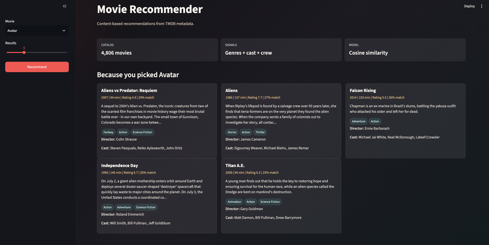

# Movie Recommender System

Content-based movie recommendation app built with Streamlit. It uses the TMDB 5000 movie metadata already included in `data/`, builds tags from overview, genres, keywords, top cast, and director, then ranks similar movies with bag-of-words vectors and cosine similarity.

## Preview



The app lets you select a movie, choose how many results to return, and view recommendations in metadata-rich cards with match score, rating, runtime, genres, director, and cast.

## Run

```bash
cd "Movie Recommender System"
python3 -m venv .venv
.venv/bin/python -m pip install -r requirements.txt
.venv/bin/streamlit run app.py
```

Open the local Streamlit URL shown in the terminal, usually `http://localhost:8501`.

## Files

- `app.py`: Streamlit frontend.
- `recommender.py`: reusable recommendation logic.
- `movie-recommender-system.ipynb`: notebook exploration and original model workflow.
- `assets/streamlit-preview.png`: app screenshot used in this README.
- `data/`: zipped TMDB CSV files used by the app.
